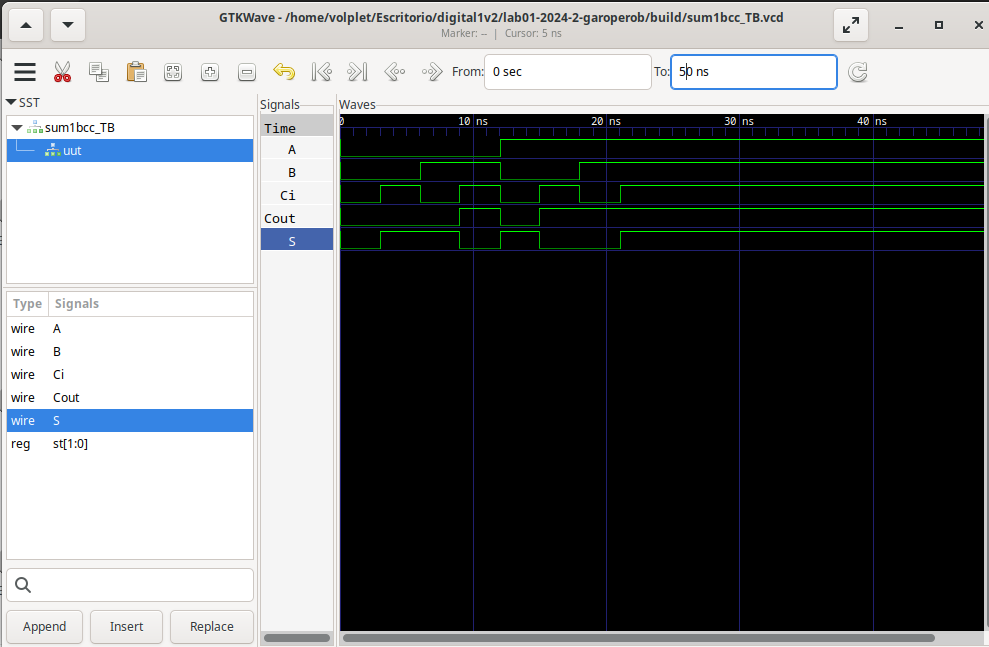

# Sumador de 1 bit 
## Gustavo Adolfo Ropero Bastidas

## Código 

Para la realización de la primera práctica se tomó el siguiente código:
```
`include "/home/volplet/Escritorio/digital1v2/lab01-2024-2-garoperob/src/sum1bcc_TB.v"
module sum1bcc (A, B, Ci,Cout,S);

  input  A;
  input  B;
  input  Ci;
  output Cout;
  output S;

  reg [1:0] st; 
  assign S = st[0];
  assign Cout = st[1];

  always @ ( * ) begin
  	st  = 	A+B+Ci;
  end
  
endmodule
``` 
Donde las palabras "module" y "endmodule" son usadas para crear un archivo en verilog, cada modulo se puede combinar para producir distintos programas. Sin embargo, sólo un archivo .v puede ser el archivo de comando principal. La declaración de las variables a usar se debe hacer en el module. Por otro lado, las palabras input y output son usadas para generar asignar las entradas y salidas, respectivamente, a partir de las variables que se tengan. Continuando con el código, se encuentra el comando "reg" que se usa para declarar registros, estos no son necesarios declararlos en module; despues, la palabra "assign"; se usa para asignarle un valor a una variable de salida. Finalmente, la línea "always @ ( * ) begin" crea un bloque funcional que se mantenie permanentemente en ejecución. Cabe aclarar, que la mayoria de las funciones de verilog encierran los procesos entre las palabras "begin" y "end".

El proceso que se lleva a cabo dentro de "always" es la suma de dos números de 1 bit y un carry de entrada. Este valor se esta asignado al regitro st, donde, el bit menos significativo se añade a la salida S, mientras que el más significativo se asigna al carry de salida. Esto se hace porque la suma produce un número de 2 bits, el cual no se puede representar con la salida de 1 bit. 
## Simulación

Para realizar la simulación se uso el software gtkwave donde se evidención que el resultado de las salidas S y Cout corresponde a los valores esperados. Como ejemplo se tiene que cuando A y B son 1 y Cin 0, el resultado de Cout es 1 y S es 0, esto después de los 18 ns. Otro ejemplo es que el valor final de la simulación (20 ns en adelante) muestra que cuando toda las entradas están en 1, los valores de salida corresponde 1, siendo la S = 1 el resultado de añadir carry de entrada y siendo Cout = 1 como el carry que sobra tras la suma. 


## Implementación
A continuación se muestra la implementación del código, donde los leds D8 y D7 muestran el resultado de la suma. Se observa que A es el primer switch que se levanta, enciendiendo D8 que representa el bit menos signifitacivo, por consiguiente, el sigueinte switch en levantarse representa B, que al sumar 1+1 da como resultado 0 y genera carry de salida que lo representa D8. Finalmente, se enciende un tercer switch, al tiempo que los otro dos, el cual es el carry de entrada; una vez se suman los 3 da como resultado 1 en el carry de salida y 1 en el resultado de las suma, mostrando los 2 leds encendidos.
 

